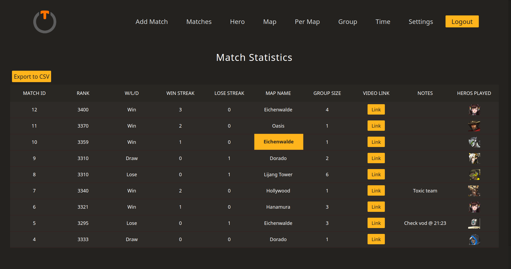

# OverTrack - Overwatch Performance Tracker
OverTrack is a web app made using rails. OverTrack helps the players of Overwatch to track their stats so that they can know their weaknesses and improve quickly.

## Demo
This project can be viewed at https://overtracker.herokuapp.com/ </br>
Alternatively, the repo can be cloned and launched locally using 
``` Rails server ```

## Screenshot

